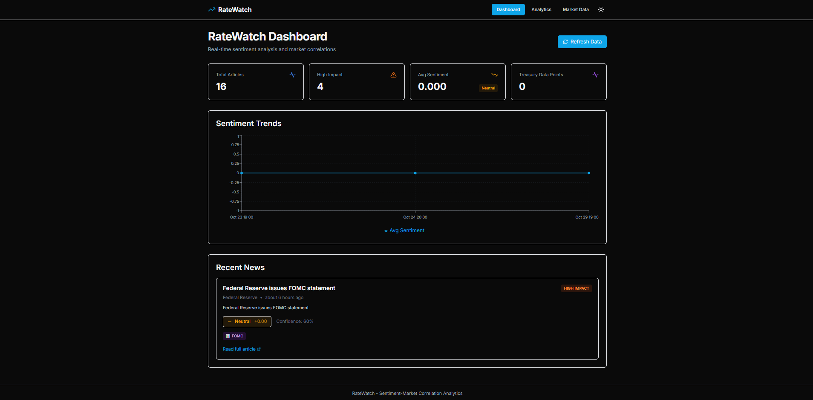

# RateWatch

**Real-time Sentiment-Market Correlation Analytics for Fixed Income**

A modern, self-contained web application that analyzes correlations between financial news sentiment and Treasury market movements using ML-powered sentiment analysis.




## 🌟 Features

### Core Capabilities
- **ML Sentiment Analysis**: FinBERT transformer model for financial news sentiment
- **Real-time News Monitoring**: Automated RSS feed collection from major financial sources
- **Entity Extraction**: Identifies Fed officials, economic indicators, and Treasury instruments
- **Correlation Analysis**: Statistical analysis of sentiment vs. yield movements
- **Modern UI**: Beautiful Next.js dashboard with dark mode support
- **Self-Contained**: No external database dependencies

### Technical Stack
- **Backend**: FastAPI (Python) with DuckDB
- **Frontend**: Next.js 14 (React, TypeScript, TailwindCSS)
- **ML/NLP**: FinBERT, PyTorch, Transformers
- **Analytics**: Pandas, NumPy, SciPy
- **Charting**: Recharts

## 🚀 Quick Start

### Prerequisites
- Python 3.9+
- Node.js 18+
- npm or yarn

### Installation

1. **Clone the repository**
```bash
git clone <your-repo-url>
cd RateWatch
```

2. **Set up the backend**
```bash
# Install Python dependencies
pip install -r backend/requirements.txt

# Optional: Set up environment variables
cp .env.example .env
# Edit .env to add your FRED API key (optional but recommended)
```

3. **Set up the frontend**
```bash
cd frontend
npm install
cd ..
```

### Running the Application

**Option 1: Run both services (recommended)**

In terminal 1 (Backend):
```bash
python -m backend.main
```

In terminal 2 (Frontend):
```bash
cd frontend
npm run dev
```

**Option 2: Development scripts**

Create these helper scripts for easier development:

`start-backend.bat` (Windows) or `start-backend.sh` (Mac/Linux):
```bash
python -m backend.main
```

`start-frontend.bat` (Windows) or `start-frontend.sh` (Mac/Linux):
```bash
cd frontend && npm run dev
```

### First Run

1. **Start the backend** (http://localhost:8000)
2. **Start the frontend** (http://localhost:3000)
3. **Open your browser** to http://localhost:3000
4. **Click "Refresh Data"** to collect initial news and sentiment data
5. **Wait 2-3 minutes** for the ML model to process news (first run downloads FinBERT model ~500MB)
6. **Explore the dashboard** to view sentiment analysis and correlations

## 📊 Usage

### Dashboard Page
- View recent sentiment-analyzed news articles
- See overall metrics (total articles, high-impact news, avg sentiment)
- Monitor sentiment trends over time
- Refresh data to fetch latest news

### Analytics Page
- Correlation analysis between sentiment and 10Y Treasury yields
- Statistical significance testing (p-values)
- Configurable lookback periods (7, 14, 30, 60, 90 days)
- Understanding of sentiment-market relationships

### Market Data Page
- Treasury yield curve visualization (2Y, 5Y, 10Y, 30Y)
- Historical yield data
- Latest yield levels

## 🏗️ Architecture

### Project Structure
```
RateWatch/
├── backend/
│   ├── api/                    # FastAPI routes
│   │   ├── news.py            # News & sentiment endpoints
│   │   ├── market.py          # Market data endpoints
│   │   ├── analytics.py       # Correlation analytics
│   │   └── data.py            # Data management
│   ├── database/
│   │   ├── schema.sql         # Database schema
│   │   └── local_db.py        # DuckDB integration
│   ├── models/                # Pydantic models
│   ├── services/              # Business logic
│   │   ├── ml_sentiment.py    # FinBERT sentiment
│   │   ├── entity_extraction.py
│   │   ├── news_collector.py  # RSS feed collection
│   │   ├── news_processor.py  # Integrated processing
│   │   ├── analytics_service.py
│   │   └── market_data.py
│   └── main.py                # FastAPI application
├── frontend/
│   ├── app/                   # Next.js 14 app router
│   │   ├── page.tsx          # Dashboard
│   │   ├── analytics/        # Analytics page
│   │   └── market/           # Market data page
│   ├── components/           # React components
│   │   ├── SentimentCard.tsx
│   │   ├── MetricsPanel.tsx
│   │   ├── TimeSeriesChart.tsx
│   │   └── ...
│   └── lib/                  # API client & utilities
├── data/                     # Local data storage
│   └── ratewatch.db         # DuckDB database
└── config/
    └── feeds.yaml           # RSS feed configuration
```

### Data Flow
1. **Collection**: RSS feeds → News Collector → Filter by keywords
2. **Processing**: FinBERT ML Analysis → Entity Extraction → Database
3. **Analytics**: Sentiment aggregation → Correlation analysis → API
4. **Visualization**: Next.js frontend → Charts & metrics

## 📖 API Documentation

Once the backend is running, visit http://localhost:8000/docs for interactive API documentation.

### Key Endpoints

#### News & Sentiment
- `GET /api/news/recent` - Get recent news with sentiment
- `GET /api/news/timeseries` - Sentiment time series data

#### Market Data  
- `GET /api/market/yields` - Treasury yield data
- `GET /api/market/etf/{ticker}` - ETF price data

#### Analytics
- `GET /api/analytics/correlation` - Sentiment-yield correlation
- `GET /api/analytics/summary` - Analytics summary

#### Data Management
- `POST /api/data/refresh` - Trigger data collection
- `GET /api/data/stats` - Database statistics

## ⚙️ Configuration

### Backend Configuration

**Environment Variables** (`.env`):
```bash
# Optional: FRED API key for Treasury data
FRED_API_KEY=your_key_here

# Database path (default: ./data/ratewatch.db)
DATABASE_PATH=./data/ratewatch.db

# API settings
API_HOST=0.0.0.0
API_PORT=8000
```

**News Feeds** (`config/feeds.yaml`):
```yaml
feeds:
  - https://www.reuters.com/markets/rss
  - https://www.federalreserve.gov/feeds/press_all.xml
  - https://www.bls.gov/feed/news.rss

keywords:
  must_have_any:
    - treasury
    - yield
    - fed
    - inflation
    # ... add more keywords

stop_words:
  - celebrity
  - sports
  # ... add words to filter out
```

### Frontend Configuration

**API URL** (`frontend/.env.local`):
```bash
NEXT_PUBLIC_API_URL=http://localhost:8000
```

## 🎨 Features Deep Dive

### ML Sentiment Analysis
- Uses **FinBERT** (ProsusAI/finbert) - state-of-the-art financial sentiment model
- Returns sentiment score (-1 to +1), label (bullish/bearish/neutral), and confidence
- Batch processing for efficiency
- GPU support (automatic fallback to CPU)

### Entity Recognition
- **Fed Officials**: Powell, Williams, Brainard, etc.
- **Economic Indicators**: CPI, NFP, FOMC, GDP, etc.
- **Treasury Instruments**: 2Y, 5Y, 10Y, 30Y
- **High-Impact Detection**: Automatically flags important news

### Correlation Analysis
- Pearson correlation between sentiment and yield changes
- Statistical significance testing (p-values)
- Lag analysis (sentiment leading vs. lagging yields)
- Rolling correlations over time
- Daily aggregation for stability

## 🔧 Development

### Backend Development
```bash
# Run with auto-reload
uvicorn backend.main:app --reload --host 0.0.0.0 --port 8000

# Run tests
pytest

# Check linting
flake8 backend/
```

### Frontend Development
```bash
cd frontend

# Development server
npm run dev

# Build for production
npm run build

# Start production server
npm start

# Lint code
npm run lint
```

## 📈 Performance

### First Run
- Model download: ~5-10 minutes (FinBERT ~500MB)
- First news collection: ~2-3 minutes for 50 articles

### Subsequent Runs
- News collection (50 items): ~30-45 seconds
- Sentiment analysis: ~20 seconds (CPU), ~5 seconds (GPU)
- Database queries: <1 second
- Dashboard load: <2 seconds

### Data Storage
- News articles (1 month): ~50MB
- DuckDB database: ~100-200MB with full historical data
- Model cache: ~500MB (one-time)

## 🚢 Deployment

### Backend Deployment
```bash
# Using Gunicorn
gunicorn backend.main:app -w 4 -k uvicorn.workers.UvicornWorker

# Using Docker
docker build -t ratewatch-backend -f backend/Dockerfile .
docker run -p 8000:8000 ratewatch-backend
```

### Frontend Deployment
```bash
cd frontend

# Build static export
npm run build

# Deploy to Vercel, Netlify, or any static host
# Or serve with Node.js
npm start
```

## 🎯 Use Cases

### For Data Science / Finance Portfolios
- Demonstrates ML/NLP skills (FinBERT implementation)
- Shows data engineering capabilities (ETL, APIs, databases)
- Statistical analysis (correlation, hypothesis testing)
- Full-stack development (FastAPI + Next.js)
- Clean, production-quality code

### For Research
- Study sentiment-market relationships
- Test different correlation hypotheses
- Analyze Fed communication impact
- Backtest sentiment-based strategies

### For Trading/Investment
- Monitor real-time fixed-income sentiment
- Track high-impact news events
- Understand sentiment drivers of yields
- Generate alerts on sentiment shifts

## 📝 Future Enhancements

### Planned Features
- [ ] Real-time WebSocket updates
- [ ] Email/SMS alerts for high-impact news
- [ ] More sophisticated backtesting
- [ ] Multi-asset correlation (equities, commodities)
- [ ] Custom news source configuration via UI
- [ ] Historical data export (CSV, JSON)
- [ ] User authentication and saved preferences
- [ ] Mobile app (React Native)

## 🤝 Contributing

Contributions are welcome! This is a portfolio/demonstration project showcasing modern data science and web development practices.

## 📄 License

MIT License - see LICENSE file for details

## 🙏 Acknowledgments

- **FinBERT Model**: ProsusAI/finbert (HuggingFace)
- **News Sources**: Reuters, Federal Reserve, BLS, Treasury
- **Market Data**: FRED API, Yahoo Finance

## ⚠️ Disclaimer

This project is for **educational and demonstration purposes only**. It is not financial advice. Past correlations do not guarantee future results. Always do your own research and consult with financial professionals before making investment decisions.

## 📧 Contact

Built as a demonstration project for data science/finance roles.

**Tech Stack Highlights**: Python, FastAPI, Next.js, TypeScript, ML/NLP, Financial Analytics, Modern UI/UX

---

**RateWatch** - Sentiment meets Markets 📈
